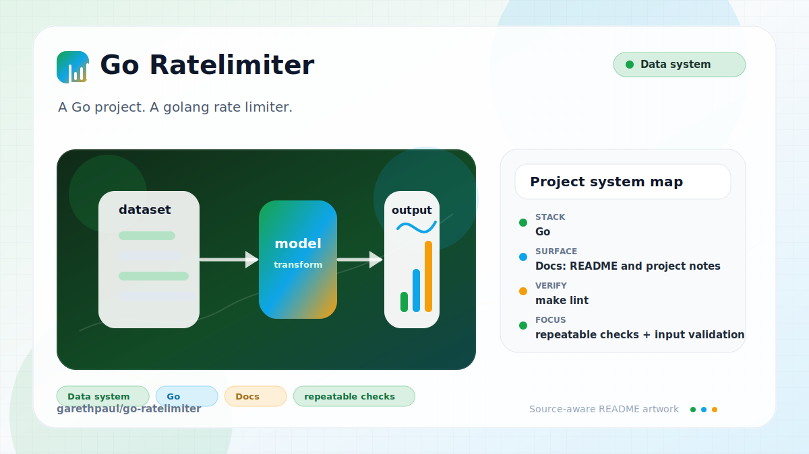

# go-ratelimiter

<!-- README-OVERVIEW-IMAGE -->


## Overview

`garethpaul/go-ratelimiter` is a Go project. A golang rate limiter.

This README is based on the checked-in source, manifests, scripts, and repository metadata on the `master` branch. The project language mix found during review was: Go (4).

## Repository Contents

- `CHANGES.md` - concise history of maintenance changes
- `Makefile` - local verification entry point
- `README.md` - project overview and local usage notes
- `config` - source or example code
- `errors` - source or example code
- `go.mod` and `go.sum` - Go module dependency metadata
- `libstring` - source or example code
- `scripts/check-baseline.sh` - Go formatting, tests, import, and documentation guardrails
- `SECURITY.md` - security reporting and disclosure guidance
- `VISION.md` - project direction and maintenance guardrails

Additional scan context:

- Source directories: config, errors, libstring
- Dependency and build manifests: go.mod, go.sum
- Entry points or build surfaces: `make check`, `go test ./...`
- Test-looking files: limiter_test.go, libstring/libstring_test.go

## Getting Started

### Prerequisites

- Git
- Go 1.25 or a compatible modern Go toolchain

### Setup

```bash
git clone https://github.com/garethpaul/go-ratelimiter.git
cd go-ratelimiter
go mod download
```

The setup commands above are derived from repository files. Legacy mobile, Python, or JavaScript samples may require older SDKs or package versions than a modern workstation uses by default.

## Running or Using the Project

- Import the package as `github.com/garethpaul/go-ratelimiter`.
- Use `LimitFuncHandler` or `LimitHandler` to wrap an HTTP handler with an in-memory token-bucket limiter.

## Testing and Verification

Run the baseline:

```bash
make check
```

The baseline runs `go test ./...`, verifies Go formatting, checks module-qualified imports, and ensures the behavior tests for key derivation, proxy-aware IP lookup, blank X-Forwarded-For entries, blank X-Real-IP values, IPv6 RemoteAddr parsing, header-value matching, and 429 responses remain in place.

When the required SDK or runtime is unavailable, use static checks and source review first, then verify on a machine that has the matching platform toolchain.

## Configuration and Secrets

- No required secret or credential file was identified in the repository scan. If you add integrations later, keep secrets out of git.

## Security and Privacy Notes

- Review changes touching authentication or token handling; examples from the scan include config/config.go, limiter.go.
- Proxy header behavior is caller-configured through `Limiter.IPLookups`; do not change lookup order semantics without tests and documentation.
- Blank X-Forwarded-For entries are skipped before limiter keys are derived,
  so malformed leading commas cannot produce an empty IP key.
- Blank or padded X-Real-IP values are trimmed or skipped before limiter keys
  are derived, allowing later configured lookup sources to be used.
- `RemoteAddr` parsing supports IPv4 and IPv6 host:port values before deriving
  limiter keys.
- Configured header values only contribute keys when the request header contains one of those configured values.

## Maintenance Notes

- See `SECURITY.md` for vulnerability reporting and safe research guidance.
- See `VISION.md` for project direction and contribution guardrails.
- Run `make check` before pushing limiter behavior, config, or import changes.

## Contributing

Keep changes small and tied to the project that is already present in this repository. For code changes, document the toolchain used, avoid committing generated dependency directories or local configuration, and update this README when setup or verification steps change.
